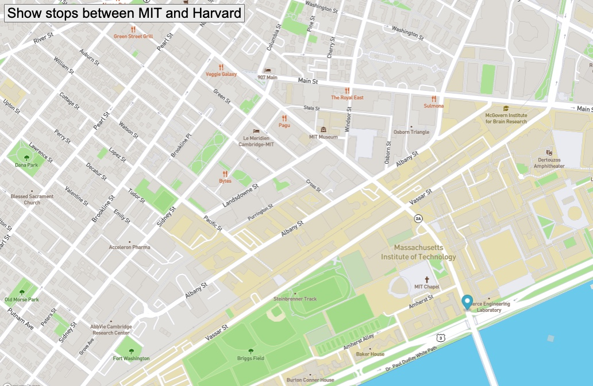

# Real_time_bus_tracker
<h1>Description:</h1> 
This program uses the mapbox API and the mapboxgl JS library to programmatically map a moving marker that details the bus route between the campuses of MIT and Harvard University upon clicking an HTML button. 

 

<h1>Instructions:</h1> 
<ul>
    <li>To use, download files and insert your own map token in the JS file 
    <li>In order to view the progromamatically animated location marker move between MIT and Harvard University, click on the provided HTML button labeled "Show stops between MIT and Harvard" 
</ul>

<h1>Plans:</h1> 
I plan on further developing this API as I continue to improve my skills.
